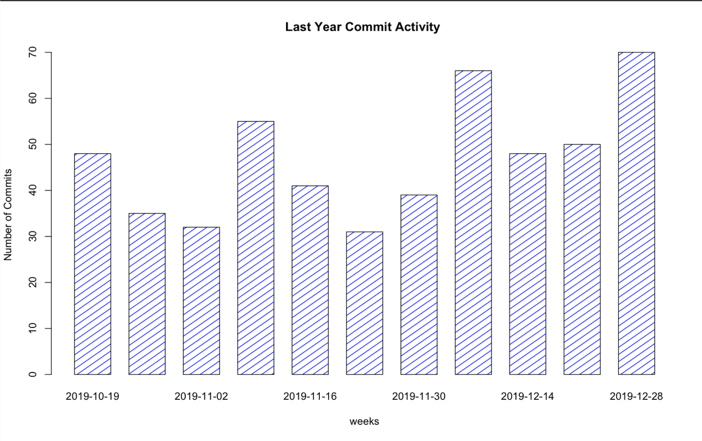
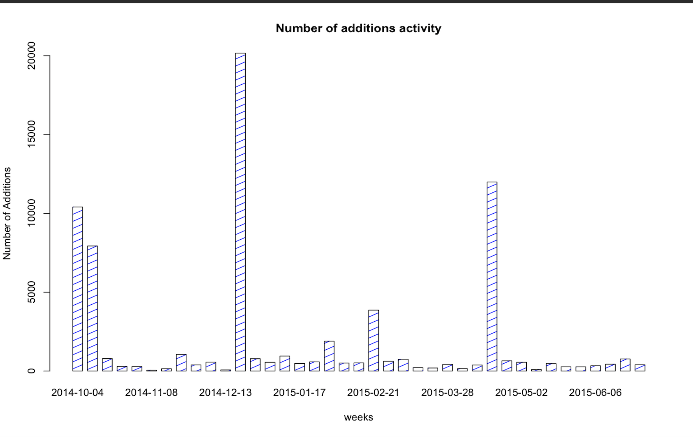
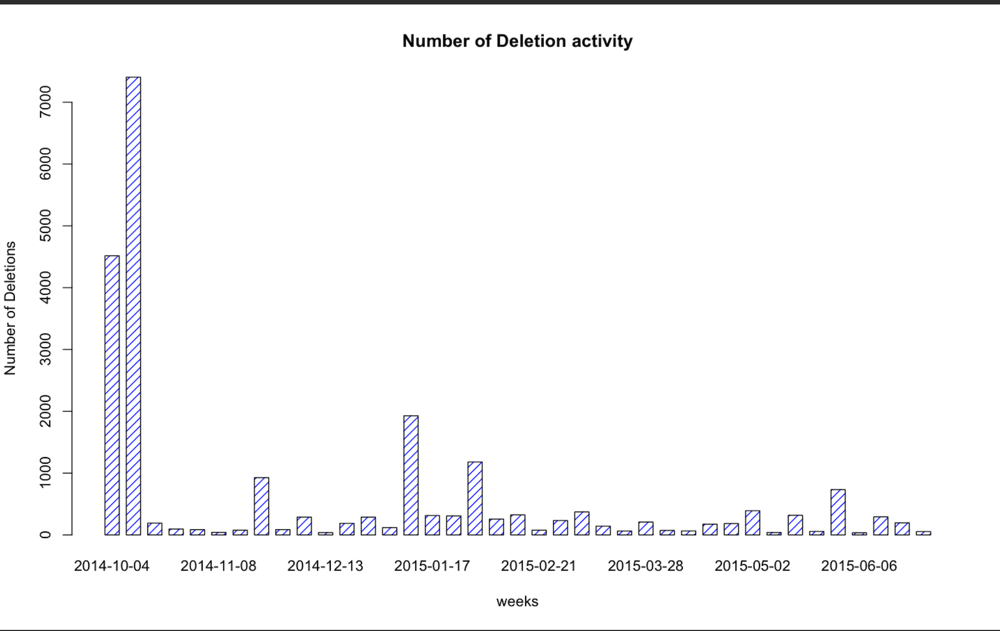

# CommerceIQTask

export Last_Year_Commit_Activity_Filename="/Users/oyo/NetBeansProjects/javacourse/src/CIQTask/last_year_commit_activity.csv";

export Addition_Deletion_Activity_Filename="/Users/oyo/NetBeansProjects/javacourse/src/CIQTask/additions_deletions.csv";

//Compile the java file as well before below command using java -o or something similar

java -jar RestClientAPI.java

//Run the r program command

r graphs.r 

Last year commit activity graphs looks like

Additions activity graphs looks like

Deletions activity graphs looks like

 

   

